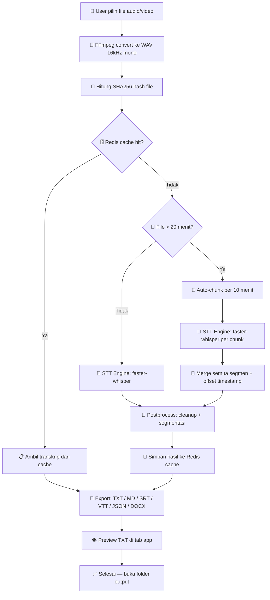

# 🎙️ GUI Voice To Text

[](https://github.com/el-pablos/GUI-Voice-To-Text/actions/workflows/ci.yml)
[](https://github.com/el-pablos/GUI-Voice-To-Text/actions/workflows/release.yml)
[](LICENSE)
[](https://python.org)
[]()

> **GUI Voice To Text — transkrip audio/video ke TXT bersih, offline, Windows 10/11, support file panjang tanpa limit.**

---

## 🆕 What's New (v0.2)

- **UI modern**: layout splitter, file table, tab Pengaturan / Preview TXT / Log
- **Tema dark & light**: toggle satu klik, default dark
- **Preview TXT**: lihat hasil transkrip langsung di app, bisa copy / save as
- **TXT bersih**: output default tanpa timestamp & speaker — opsi ada di Pengaturan
- **Auto-chunking**: file panjang (>20 menit / >200 MB) dipotong otomatis per 10 menit
- **Tanpa limit**: timeout FFmpeg dinamis berdasarkan durasi file
- **Model reuse**: engine Whisper lazy-load dan reuse model antar chunk
- **Windowed EXE**: `.exe` tidak menampilkan console window

---

## 📋 Untuk Siapa?

- **Mahasiswa** yang butuh transkrip hasil sidang skripsi / wawancara penelitian
- **Peneliti** yang perlu konversi rekaman FGD / wawancara mendalam
- **Dosen / penguji** yang ingin review hasil sidang
- **Siapa saja** yang butuh konversi audio/video → teks dengan cepat dan _offline_

---

## ✨ Fitur Utama

| Fitur | Keterangan |
|-------|-----------|
| 🎵 **Multi-format input** | WAV, MP3, M4A, AAC, OGG, FLAC, WMA, MP4, MKV, MOV, AVI, WEBM |
| 📄 **Multi-format output** | TXT, Markdown, SRT, VTT, JSON, DOCX |
| 🧠 **Offline-first** | Pakai [faster-whisper](https://github.com/SYSTRAN/faster-whisper) — tidak butuh internet |
| 🗣️ **Speaker label** | Heuristic diarization (pemisahan speaker otomatis berdasarkan jeda) |
| 🗄️ **Redis caching** | File yang sama tidak ditranskrip ulang (hemat waktu) |
| 🖥️ **GUI Desktop** | PySide6 UI — drag & drop, file table, progress bar, konfigurasi visual |
| 🌗 **Tema Dark / Light** | Toggle tema gelap-terang dengan satu klik |
| 📋 **Preview TXT** | Tab preview hasil transkripsi langsung di app — bisa copy / save as |
| 🔀 **Auto-chunking** | File panjang (>20 menit / >200 MB) otomatis dipotong per 10 menit |
| ♾️ **Tanpa limit** | Tidak ada batasan ukuran / durasi file — timeout FFmpeg dinamis |
| ⌨️ **CLI batch** | Proses banyak file sekaligus lewat terminal |
| 🧹 **Text cleanup** | Normalisasi spasi, hapus noise token, opsi hapus filler (eee, anu) |
| ⏱️ **Timestamp** | Per kalimat / per segmen (opsional di TXT — default: teks bersih) |
| 📦 **Portable .exe** | Download 1 file, langsung jalankan — windowed, tanpa console |

---

## 🏗️ Arsitektur

```
gui-voice-to-text/
├── app/
│   ├── main.py                    # Entry point UI (PySide6 + High DPI)
│   ├── cli.py                     # Entry point CLI (argparse)
│   ├── core/
│   │   ├── hashing.py             # SHA256 hash file + cache key
│   │   ├── ffmpeg.py              # FFmpeg detect, probe, convert (timeout dinamis)
│   │   ├── cache.py               # Redis cache (env-based, fallback aman)
│   │   ├── chunking.py            # Auto-split file panjang jadi chunk 10 menit
│   │   ├── pipeline.py            # Orchestrator: convert → chunk → transcribe → export
│   │   ├── engines/
│   │   │   ├── base.py            # Interface BaseEngine + TranscriptResult
│   │   │   ├── faster_whisper.py  # Default: faster-whisper (model reuse, lazy init)
│   │   │   └── vosk_engine.py     # Fallback: Vosk (ringan)
│   │   ├── exporters/
│   │   │   ├── txt.py             # TXT bersih (tanpa timestamp/speaker by default)
│   │   │   ├── md.py, srt.py, vtt.py
│   │   │   ├── json_export.py, docx_export.py
│   │   └── postprocess/
│   │       ├── cleanup.py         # Normalisasi teks, hapus noise/filler
│   │       └── segmentation.py    # Merge segmen, heuristic diarization
│   └── ui/
│       ├── window.py              # MainWindow — QSplitter + QTabWidget layout
│       ├── widgets.py             # FileDropZone, FileTable, ConfigPanel, PreviewPanel
│       ├── theme.py               # Sistem tema dark/light (QSS)
│       └── state.py               # AppState centralized
├── tests/                         # pytest — 100+ tests, 100% passed
├── .github/workflows/
│   ├── ci.yml                     # Test + lint otomatis
│   └── release.yml                # Build .exe windowed + auto release
├── pyproject.toml
├── .env.example
└── .gitignore
```

---

## 🔄 Diagram Alur (Pipeline)



---

## 🚀 Cara Pakai

### Opsi 1: Download `.exe` (Paling Gampang)

1. Buka halaman [**Releases**](https://github.com/el-pablos/GUI-Voice-To-Text/releases)
2. Download `GUIVoiceToText.exe`
3. Jalankan — selesai! _(butuh FFmpeg di PATH atau taruh di folder `tools/ffmpeg/`)_

### Opsi 2: Jalankan dari Source

```powershell
# Clone repo
git clone https://github.com/el-pablos/GUI-Voice-To-Text.git
cd GUI-Voice-To-Text

# Buat virtual environment
python -m venv .venv
.\.venv\Scripts\Activate.ps1

# Install dependencies
pip install -e ".[dev]"

# Jalankan UI
python -m app.main

# Atau CLI
python -m app.cli rekaman.mp3 -f txt md srt -l id -m base
```

### CLI Usage

```powershell
# Transkrip 1 file
python -m app.cli "rekaman sidang.mp3" -o output/ -f txt md srt -l id

# Batch folder
python -m app.cli folder_rekaman/ -f txt json -m small

# Dengan opsi lengkap
python -m app.cli file.wav -f txt md srt vtt json docx \
    -l id -m medium --remove-filler --diarization heuristic -v
```

---

## ⚙️ Konfigurasi

### Environment Variables

Copy `.env.example` → `.env` lalu isi:

| Variable | Deskripsi | Default |
|----------|-----------|---------|
| `REDIS_HOST` | Host Redis (kosong = tanpa cache) | _(kosong)_ |
| `REDIS_PORT` | Port Redis | `6379` |
| `REDIS_USER` | Username Redis (opsional) | _(kosong)_ |
| `REDIS_PASSWORD` | Password Redis | _(kosong)_ |
| `REDIS_DB` | Nomor database Redis | `0` |
| `CACHE_TTL_SECONDS` | TTL cache dalam detik | `2592000` (30 hari) |
| `FFMPEG_PATH` | Path ke ffmpeg.exe (opsional) | auto-detect |
| `FFPROBE_PATH` | Path ke ffprobe.exe (opsional) | auto-detect |

> ⚠️ **Jangan commit `.env` ke repo!** File ini sudah ada di `.gitignore`.

### FFmpeg

Tool ini butuh FFmpeg untuk konversi format. Opsi:

1. **Install ke PATH**: Download dari [ffmpeg.org](https://ffmpeg.org/download.html), tambahkan ke PATH
2. **Portable**: Taruh `ffmpeg.exe` dan `ffprobe.exe` di folder `tools/ffmpeg/`
3. **Environment variable**: Set `FFMPEG_PATH` di `.env`

---

## 🧪 Testing

```powershell
# Run semua test
python -m pytest -q

# Dengan coverage
python -m pytest --cov=app --cov-report=term-missing

# Hanya module tertentu
python -m pytest tests/test_hashing.py -v
```

**Status: 100+ tests passed, 2 skipped (butuh ffmpeg + fixture besar)**

---

## 🔧 Development

### Tech Stack

| Komponen | Teknologi |
|----------|-----------|
| Bahasa | Python 3.11+ |
| GUI | PySide6 (Qt6) |
| STT Engine | faster-whisper (CTranslate2) |
| Caching | Redis (via `redis-py`) |
| Konversi Media | FFmpeg |
| Export DOCX | python-docx |
| Testing | pytest + pytest-cov |
| Lint | ruff |
| Packaging | PyInstaller |
| CI/CD | GitHub Actions |

### Model Whisper

| Model | Ukuran | Kecepatan | Akurasi |
|-------|--------|-----------|---------|
| `tiny` | ~75 MB | ⚡⚡⚡ | ⭐⭐ |
| `base` | ~150 MB | ⚡⚡ | ⭐⭐⭐ |
| `small` | ~500 MB | ⚡ | ⭐⭐⭐⭐ |
| `medium` | ~1.5 GB | 🐢 | ⭐⭐⭐⭐⭐ |
| `large-v3` | ~3 GB | 🐌 | ⭐⭐⭐⭐⭐+ |

> **Rekomendasi**: `base` untuk sidang biasa, `small`/`medium` untuk akurasi tinggi.

---

## 🤝 Kontributor

| | Nama | GitHub |
|---|------|--------|
| 🧑‍💻 | el-pablos | [@el-pablos](https://github.com/el-pablos) |

---

## 📄 Lisensi

MIT License — bebas dipakai, dimodifikasi, dan didistribusikan.

---

<p align="center">
  <sub>Dibuat dengan ☕ untuk mahasiswa Indonesia yang butuh transkrip sidang skripsi.</sub>
</p>
